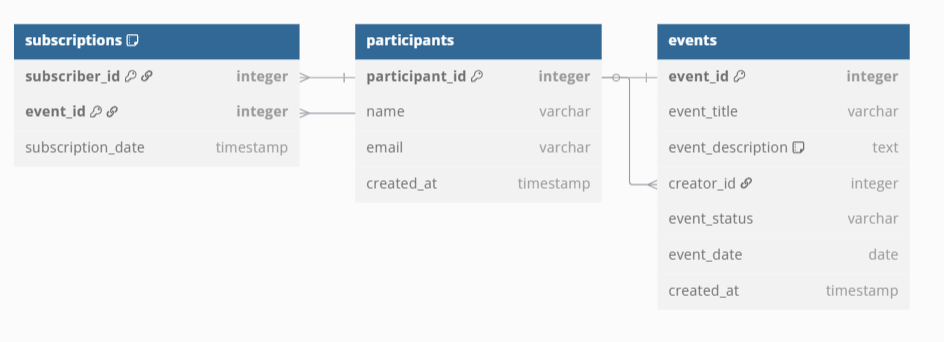
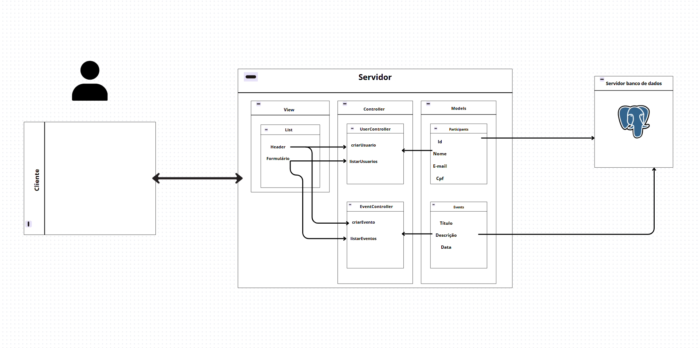

# WAD - Sistema de Gerenciamento de Eventos

## Introdução
O Sistema de Gerenciamento de Eventos é uma aplicação desenvolvida com foco na organização e gerenciamento de eventos e inscrições. Os participantes podem se cadastrar, criar eventos, inscrever-se em eventos e visualizar eventos existentes. A estrutura segue o padrão MVC e utiliza PostgreSQL como banco de dados.

### Funcionalidades:
- Cadastro de participantes
- Criação de eventos
- Inscrição em eventos
- Consulta de eventos e participantes

## Diagrama do Banco de Dados
O diagrama ERD a seguir ilustra a estrutura do banco de dados, incluindo as tabelas `participants`, `events` e `subscriptions`:

### Descrição das Tabelas:
- **participants:** Armazena os participantes cadastrados no sistema.
- **events:** Armazena os eventos criados pelos participantes.
- **subscriptions:** Armazena as inscrições dos participantes nos eventos.

## Modelo Relacional
- Um participante pode criar vários eventos.
- Um participante pode se inscrever em vários eventos.
- Um evento pode ter várias inscrições, mas cada inscrição está vinculada a um único participante.

## Arquitetura MVC

